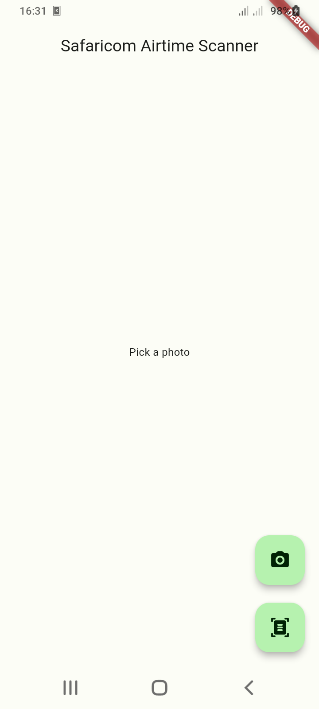
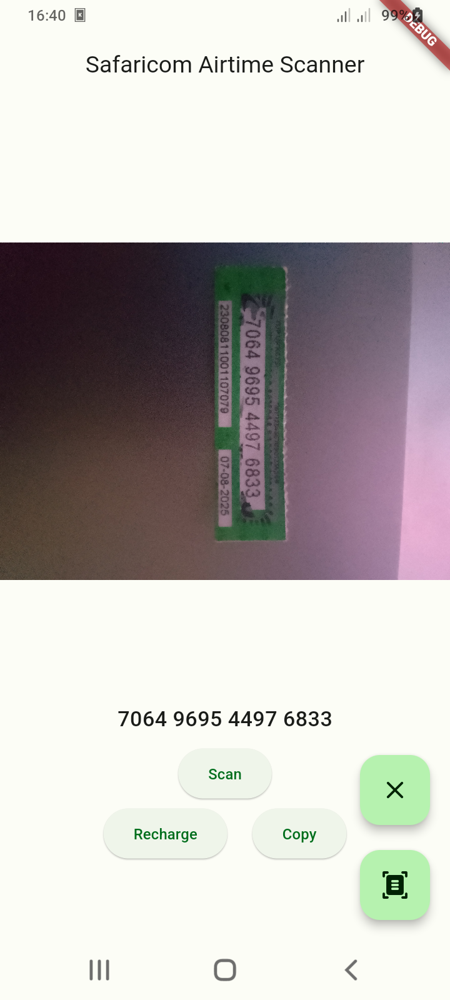

# safaricom_airtime_scanner

This repository contains the source code for the Safaricom Airtime Scanner app, a Flutter project that revolutionizes the way users recharge their mobile airtime. By leveraging Google ML Vision technology, this application offers seamless and efficient scanning of airtime scratch cards, eliminating the need for manual entry of voucher codes.

## Demo Video

Check out the demo video of the Safaricom Airtime Scanner app on YouTube: [Watch Demo](https://youtu.be/IDYHVyAw4Dg)

## About the Project

The Safaricom Airtime Scanner app is built using Flutter, a cross-platform framework for building mobile applications. It integrates Google ML Vision technology to provide real-time recognition of voucher codes, ensuring swift and accurate scanning.

## Getting Started

To get started with the Safaricom Airtime Scanner app:

1. Clone this repository to your local machine.
2. Ensure you have Flutter installed. If not, follow the [Flutter installation instructions](https://flutter.dev/docs/get-started/install).
3. Open the project in your preferred IDE or text editor.
4. Run the app on an emulator or physical device using `flutter run`.

## Contributing

Contributions are welcome! If you'd like to contribute to the Safaricom Airtime Scanner app, please follow these steps:

1. Fork the repository.
2. Create a new branch (`git checkout -b feature/your-feature-name`).
3. Make your changes.
4. Commit your changes (`git commit -am 'Add new feature'`).
5. Push to the branch (`git push origin feature/your-feature-name`).
6. Create a new Pull Request.
